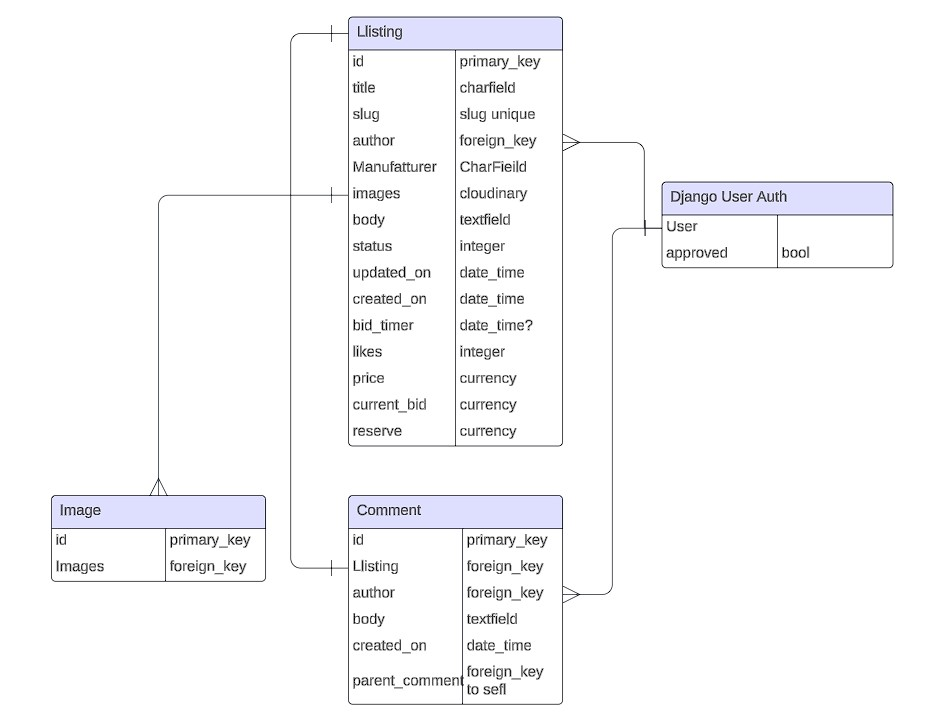

# Watch Bid Central

'WatchBidCentral' is an exclusive digital haven tailored for the aficionados of timekeeping, offering a marketplace that celebrates the art and craft of luxury watches. This platform is not just a website; it's a dynamic community for both sellers and buyers to engage in the passionate exchange of exquisite timepieces. From vintage classics to contemporary marvels, WatchBidCentral is dedicated to connecting watch enthusiasts around the globe.

Here, users can craft listings for their cherished watches, bid on a diverse collection from esteemed manufacturers, and immerse in a realm where precision meets elegance. WatchBidCentral prides itself on ensuring a secure, transparent, and straightforward experience, making it the premier destination for acquiring and distributing luxury watches.

Embracing the legacy and innovation of the watchmaking tradition, WatchBidCentral is a confluence of history, artistry, and technology. It's a community where every tick, design, and story behind the watch matters, offering a unique space for enthusiasts to share, discover, and elevate their passion for watches. Join the journey at WatchBidCentral, where every second is a celebration of time's endless dance.

<center> 

 

</center>


Developer: [Barry Flynn](https://github.com/barryCFlynn/) <br>
[Live webpage](https://watch-bid-central-95b83adfb641.herokuapp.com/)<br>
[Project Repository](https://github.com/barryCFlynn/WatchBidCentral)<br>


---

## Table of Content

- [Project Goals](#project-goals)
    + [User Goals](#user-goals)
    + [Site Owner Goals](#site-owner-goals)
- [User Experience](#user-experience)
    + [Target Audience](#target-audience)
    + [User Requirements and Expectations](#user-requirements-and-expectations)
    + [User Stories](#user-stories)
      - [Epic 1: User Experience (Visitor)](#epic-1--user-experience--visitor-)
      - [Epic 2: User Engagement and Interaction (Registered User)](#epic-2--user-engagement-and-interaction--registered-user-)
      - [Epic 3: Administration and Content Management (Admin/Content Moderator)](#epic-3--administration-and-content-management--admin-content-moderator-)
- [Database](#database)
    + [Blog Application Database Schema](#blog-application-database-schema)
      - [CultureCategory Table](#culturecategory-table)
      - [UserProfile Table](#userprofile-table)
      - [User Table](#user-table)
      - [Post Table](#post-table)
      - [Comment Table](#comment-table)
- [Design](#design)
    + [Design Choices](#design-choices)
    + [Color](#color)
    + [Fonts](#fonts)
    + [Structure](#structure)
      - [Before User logs in:](#before-user-logs-in-)
      - [After User logged in:](#after-user-logged-in-)
      - [Profile Navigation:](#profile-navigation-)
    + [Wireframes](#wireframes)
- [Technologies Used](#technologies-used)
    + [Languages](#languages)
    + [Frameworks](#frameworks)
    + [Database](#database-1)
    + [Media management platform](#media-management-platform)
    + [Tools](#tools)
    + [Supporting Libraries and Packages](#supporting-libraries-and-packages)
- [Methodology](#methodology)
    + [Agile Project Management with GitHub Projects](#agile-project-management-with-github-projects)
    + [User Stories as GitHub Issues](#user-stories-as-github-issues)
    + [Bug Tracking for Seamless Development](#bug-tracking-for-seamless-development)
    + [Iterative Development Approach](#iterative-development-approach)
    + [Future Backlog and Progress](#future-backlog-and-progress)
- [Features](#features)
    + [Landing Page:](#landing-page-)
    + [Other Pages:](#other-pages-)
    + [User Account Management:](#user-account-management-)
    + [Navigation:](#navigation-)
    + [Future Features](#future-features)
- [Testing](#testing)
- [Bugs](#bugs)
    + [Known bugs](#known-bugs)
    + [Fixed bugs](#fixed-bugs)
- [Deployment](#deployment)
    + [App Deployment](#app-deployment)
    + [Cloudinary](#cloudinary)
    + [Version Control](#version-control)
    + [Forking the Repository:](#forking-the-repository-)
    + [Clone of the Repository:](#clone-of-the-repository-)
- [Credits](#credits)
    + [Media](#media)
    + [Django Documentation:](#django-documentation-)
    + [Bootstrap docs:](#bootstrap-docs-)
    + [Tutorials and YouTube channels:](#tutorials-and-youtube-channels-)
    + [Content](#content)
- [Acknowledgments](#acknowledgments)

---

# Project Goals 

WatchBidCentral is a Django-based web application dedicated to watch enthusiasts and collectors, offering a sophisticated platform for the buying and selling of luxury watches. The main goals of the project include:

To create a secure and user-friendly marketplace where users can list their watches for sale and participate in bidding on a wide range of luxury timepieces.
To foster a community of watch enthusiasts who can share their passion, knowledge, and experiences related to various brands and models.
To implement a transparent and trustworthy verification process ensuring the authenticity and quality of the watches listed on the platform.
To provide comprehensive user profiles that allow sellers to showcase their collections and buyers to express their preferences and watch interests.
To enable a seamless and intuitive user experience from listing watches to placing bids, with a focus on high-quality images and detailed descriptions.

### User Goals

- To discover a wide selection of luxury watches from reputable sellers and verified listings.
- To find a specialized platform that caters exclusively to the needs and interests of watch collectors and enthusiasts.
- To safely buy and sell luxury watches within a community that values authenticity, quality, and the finer details of horology.
- To connect with other users, share insights, and gain knowledge about different watches and their historical significance.

### Site Owner Goals

- To establish WatchBidCentral as a premier online destination for luxury watch transactions, recognized for its commitment to quality, authenticity, and community engagement.
- To create a sustainable business model that attracts a global audience of watch lovers and collectors, providing them with a reliable platform for their buying and selling needs.
- To continuously improve the platform based on user feedback and technological advancements, ensuring a state-of-the-art experience for all community members.

<p align="right">(<a href="#table-of-content">back to top</a>)</p>

---

# User Experience

### Target Audience

WatchBidCentral is tailored for the following target audience:

- Watch enthusiasts and collectors seeking a dedicated platform to buy and sell luxury timepieces.
- Individuals interested in learning about horology and connecting with a community that shares their passion for high-quality watches.
- Sellers looking for a trustworthy marketplace to list their luxury watches and reach a global audience of potential buyers.
- Buyers in search of a secure and user-friendly environment to discover authentic luxury watches from reputable sellers.


### User Requirements and Expectations

When using WatchBidCentral, users can expect the following features and characteristics to fulfill their needs:

- A visually appealing and easy-to-navigate interface that enhances the experience of buying and selling watches.
- A secure registration and login process, safeguarding user data and transactions.
- Interactive features such as the ability to place bids, create listings, and engage with other users through comments.
- A personalized user profile where sellers can showcase their watches and buyers can manage their bids and watchlist.
- Access to a curated selection of luxury watches, with detailed information and images to ensure authenticity and quality.


### User Stories

User stories and tasks Grouped below.

- [As a Site Admin, I can create, edit, and delete advertisements - complete](https://github.com/barryCFlynn/WatchBidCentral/issues/1)
- [As a Seller, I can place offers on advertisements and manage my own listings - Partially complete](https://github.com/barryCFlynn/WatchBidCentral/issues/2)
- [As a Buyer, I can bid on advertisements, leave comments, and reply to comments - complete](https://github.com/barryCFlynn/WatchBidCentral/issues/3)
- [Paginated list of posts - complete](https://github.com/barryCFlynn/WatchBidCentral/issues/4)
- [Carousel of most liked listings - Partially complete](https://github.com/barryCFlynn/WatchBidCentral/issues/5)
- [Open a Listed Item - complete](https://github.com/barryCFlynn/WatchBidCentral/issues/6)
- [Comments and Comments on comments - Partially complete](https://github.com/barryCFlynn/WatchBidCentral/issues/7)
- [View Notifications - Partially complete](https://github.com/barryCFlynn/WatchBidCentral/issues/8)
- [About Page - complete](https://github.com/barryCFlynn/WatchBidCentral/issues/9)
- [Account Registration - complete](https://github.com/barryCFlynn/WatchBidCentral/issues/10)
- [Comment on a Listing - complete](https://github.com/barryCFlynn/WatchBidCentral/issues/11)


<br>

<p align="right">(<a href="#table-of-content">back to top</a>)</p>

---

# Database
When creating the database structure schema for this project, I utilized the [dbdiagram.io](https://dbdiagram.io/) website. This online tool allowed me to visually design and document the database schema, making it easier to plan and implement the database for the blog application.

<center> 

  

</center>

## Database Schema Summary

### `Django User Auth` Table
- Represents the basic user information according to Django's built-in User model.
- Fields: `username`, `email`, `password`.

### `Listing` Table
- Extends the User model to store additional information and personal preferences.
- Fields: `title`, `status`, `slug`, `author`, `manufacturer`, `body`, `created_on`, `updated_on`, `bid_timer`, `price`, `current_bid`, `reserve`, `likes`.

### `Image` Table
- Stores the watch images so that each listing can have mutiple images.
- Fields: `image`

### `Comment` Table
- Stores comments made by users on blog posts.
- Fields: `listing`, `author`, `parent_comment`, `body`, `created_on`.

This database schema outlines the structure for WatchBidCentral, enabling user engagement with watch listings, personalization of user profiles, categorization of watches by manufacturer, and community interaction through bids, comments and likes.

<br>

<p align="right">(<a href="#table-of-content">back to top</a>)</p>

---

# Design

The design of WatchBidCentral is meticulously crafted to resonate with the sophistication and elegance associated with luxury watches. The choice of colors, fonts, and layout are carefully selected to provide an upscale and professional feel, inviting users into a world of high-end watch collecting. The interface combines modern design principles with intuitive navigation, ensuring that both seasoned collectors and new enthusiasts can easily explore, bid, and list watches. The design aims to evoke trust and reliability, mirroring the quality and authenticity of the timepieces featured on the platform.

### Color

For colour the template I used "https://startbootstrap.com/template/shop-homepage" had a very simple colour scheme that I opted to not chnang:


Primary Background Colour

 

Secondary Background Colour


Contrast Grid - Only AA and AAA options used.

 

#### Before User Logs In:

- **Home Page Featuring Top Listings:** Users land on a dynamic homepage that highlights the most liked and recent watch listings. The page features a sleek, modern design with high-quality images of watches, inviting users to explore the offerings. Navigation is streamlined through a top menu bar that includes links to various site sections, including 'Sell Your Watch,' 'Top Liked Watches,' and 'About Us.' For new visitors, clear calls to action for registration or login are prominently placed, ensuring easy access to the platform's full features.

- **About Us:** This page provides insightful information about the platform, its mission, and what new members can expect upon joining. It serves as an introduction to the site's ethos, focusing on creating a secure and user-friendly environment for watch enthusiasts and collectors to buy and sell luxury watches.

- **Register:** The 'Register' page invites new users to easily register, unlocking access to exclusive site features such as creating their own watch listings and managing their collections through 'My Listings'. This step is the gateway to actively participating in the watch enthusiast community, allowing users to buy, sell, and connect with others who share their passion.


#### After User Logs In:

Post-login, users gain access to a range of interactive and personalized features:

- **Create Listings:** A cornerstone feature of the platform, the 'Create Listings' page empowers users to become sellers in their own right. Here, members can list their watches for sale, providing detailed descriptions, setting prices, and uploading high-quality images to showcase their timepieces. This user-friendly interface is designed to guide sellers through the listing process, ensuring that each watch is presented in the best possible light to potential buyers. Whether you're a seasoned collector or looking to sell a single cherished piece, this feature makes it straightforward to connect with interested parties.


- **View My Listings:** Designed for user convenience, the 'View My Listings' page is a personalized dashboard where sellers can manage their active listings. This section allows users to track the status of each watch they have put up for sale, including current bids, and direct messages from interested buyers. It's a central hub for all selling activities, offering tools to edit listings, update prices, or remove items if necessary. This feature ensures sellers have full control over their sales process, making it easy to manage their offerings in a structured and efficient manner.


- **Edit Your Listings:** The 'Edit Your Listings' feature provides sellers with the flexibility to update their watch listings at any time. Whether it's adjusting the price, updating the description, or adding new images, sellers can ensure their listings are always accurate and appealing. This section is accessible directly from the 'View My Listings' dashboard, offering an intuitive interface for making changes. By supporting ongoing adjustments, this feature empowers sellers to respond to market demand, feedback from potential buyers, or changes in the condition or availability of their watches, maintaining the relevance and attractiveness of their offerings.


- **Delete Your Listing:** This functionality allows sellers to remove their watch listings from the platform with ease. Whether the watch has been sold, withdrawn from sale, or for any other reason, sellers can quickly and securely delete their listings from their 'View My Listings' dashboard. This ensures that the platform remains up-to-date with only available watches being displayed, enhancing the buying experience for potential buyers. The deletion process is designed to be straightforward, with confirmation prompts to prevent accidental deletions, ensuring that sellers have full control over their listings on the site.


- **Comment:** The comment feature enhances the interactive experience on the platform, allowing users to engage with listings in a meaningful way. Whether you're interested in learning more about a watch, seeking further details from the seller, or simply want to express admiration for a particular timepiece, the comment section is your space to communicate. This feature fosters a community atmosphere, enabling users to share insights, ask questions, and offer feedback directly on the listing page. It's an invaluable tool for both buyers and sellers to interact, clarify details, and build connections within the watch enthusiast community.

<p align="right">(<a href="#table-of-content">back to top</a>)</p>

---

# Technologies Used

### Languages
- HTML
- CSS
- Python
- JavaScript

### Frameworks
- **Django**: A high-level Python web framework that encourages rapid development and clean, pragmatic design, used for building the Culture Club web application.
- **Crispy Forms**: A Django package that simplifies form layout and styling, making forms more efficient and customizable.
- **Bootstrap v5.0**: The latest version of the popular CSS framework, used for creating responsive and visually appealing user interfaces.

### Database
- **ElephantSQL**: A cloud-hosted PostgreSQL database service, offering a reliable and scalable storage solution for the application's data.

### Media Management Platform
- **Cloudinary**: A cloud-based platform for media upload, storage, optimization, and delivery, used for managing images in the Culture Club project.

### Tools
- **Git**: A version control system for tracking changes in source code during software development.
- **GitHub**: A platform for hosting and managing Git repositories, enabling collaboration and version control for the project's codebase.
- **Gitpod**: A cloud-based IDE that provides a consistent and pre-configured development environment for the Culture Club project.
- **Heroku**: A cloud application platform used for deploying and hosting the Culture Club web application.
- **Adobe Photoshop**: A graphic design software used for editing and refining images for the website.
- **DB Diagram**: A tool for visualizing and creating database schemas, used for planning the database structure of Culture Club.
- **Google Fonts**: A library of free, open-source fonts, used to enhance typography on the website.
- **Font Awesome**: A library of icons and social logos, used for adding graphical elements to the Culture Club interface.
- **ChatGPT**: An AI to help troubleshoot issues.

### Supporting Libraries and Packages

- `asgiref==3.7.2`: foundational package for Django to support asynchronous web protocols like WebSockets.
- `cloudinary==1.36.0`: integration library for Cloudinary - cloud service for storing and managing media files and assets.
- `dj-database-url==0.5.0`: utility to help you configure your Django application's database from the DATABASE_URL environment variable.
- `dj3-cloudinary-storage==0.0.6`: Django storage backend for Cloudinary to handle media and static files.
- `Django==4.2.10`: Django web framework; the core framework for the web application.
- `django-allauth==0.57.2`: integrated set of Django applications addressing authentication, registration, account management, and third-party (social) account authentication.
- `django-crispy-forms==2.1`: Django app that provides a way to render Django forms in a DRY, configurable, and reusable way.
- `django-summernote==0.8.20.0`: Django app that integrates the Summernote WYSIWYG editor for text fields.
- `gunicorn==20.1.0`: Python WSGI HTTP Server for UNIX - robust and performant server to serve the Django application.
- `oauthlib==3.2.2`: generic, spec-compliant implementation of OAuth for use as a foundation for OAuth consumers and providers.
- `psycopg2==2.9.9`: PostgreSQL database adapter for Python, a prerequisite for using PostgreSQL with Django.
- `PyJWT==2.8.0`: Python library to encode and decode JSON Web Tokens (JWT), often used in authentication mechanisms.
- `python3-openid==3.2.0`: Python 3 port of the Python OpenID library, used for OpenID authentication.
- `PyJWT==2.8.0`: Python library that allows accurate and cross-platform timezone calculations.
- `requests-oauthlib==1.3.1`: An OAuthlib authentication support for Requests, which allows you to use OAuth to authenticate with APIs.
- `sqlparse==0.4.4`: non-validating SQL parser for Python, useful for parsing and splitting SQL statements.
- `urllib3==1.26.15`: powerful HTTP client for Python. Used by Requests internally.
- `whitenoise==5.3.0`: efficiently serves static files in Django applications, enhancing performance.

<p align="right">(<a href="#table-of-content">back to top</a>)</p>

---

# Methodology

The WatchBidCentral project adheres to an agile-inspired methodology, promoting teamwork, adaptability, and incremental development. This strategy has steered the project's progress:

### Agile Project Management with GitHub Projects
To streamline project management, GitHub Projects is employed as a central hub. User stories and tasks are structured as GitHub issues, creating an organized workflow. The GitHub project board serves as a visual representation, tracking progress effectively.

### User Stories as GitHub Issues
Transforming user stories into GitHub issues captures user-centric functionalities. These issues interlink with respective user stories, simplifying access to criteria, tasks, and comments.

<p align="right">(<a href="#table-of-content">back to top</a>)</p>

---

# Features
### Login Landing Page:
- Description: The landing page provides a carousel of most liked listings and a list of watches ordered by created date.
<details><summary>See Screenshot **Landingpage, large**</summary></details>
<details><summary>See Screenshot **Landingpage, mobile**</summary></details>

### About Us:
- Description: A detailed section about the company and services. 
<details><summary>See Screenshot **About us, large**</summary></details>
<details><summary>See Screenshot **About us, mobile**</summary></details>

### Create Listing:
- Description: A form to create a new listing to host on the site.
<details><summary>See Screenshot **Sign Up, large**</summary></details>
<details><summary>See Screenshot **Sign Up, mobile**</summary></details>

### Liked Listings:
- Description: A filtered view of all the watch listings by most liked.
<details><summary>See Screenshot **Sign Up, large**</summary></details>
<details><summary>See Screenshot **Sign Up, mobile**</summary></details>

### My Listings:
- Description: A view for a seller of their listings to manage them.
<details><summary>See Screenshot **Sign Up, large**</summary></details>
<details><summary>See Screenshot **Sign Up, mobile**</summary></details>

### Future Features
Here are some exciting features that I would like to add to the site in the future:

| Feature | Description |
| --- | --- |
| **Restrict Likes to one per site user** | Implement the restriction to limit the times a person can like a post. |
| **Nested Comments** | Implement nested comments to all for greater depth in engagement |
| **Bid Timer** | Allow a seller to set a timer on the listing |
| **Comment Editing and Deletion** | Enable users to edit and delete their comments for better content control. |
|  |  |

<br>

<p align="right">(<a href="#table-of-content">back to top</a>)</p>

---

# Testing

WatchBidCentral underwent extensive testing to ensure its functionality, accessibility, and performance were up to standard. This rigorous process included code validation, accessibility checks, performance evaluation, cross-device compatibility testing, browser compatibility confirmation, reviewing user stories, and incorporating user feedback to improve the overall experience.

### Automated testing

The files are located in each app, in a folder called "Tests". to run the test run "python manage.py test" from a terminal.

#### Manual Testing

- The website was tested on Google Chrome and Microsoft Edge.
- The website was viewed on various monitors and resolutions and on a Pixel 7 mobile phone.
- Chrome Dev Tools was used to test how the site looks on various screen sizes.

<details>
<summary>Linter - PASS</summary>

  - Javascript tested on both sites with no significant errors

    - [JSHint](https://jshint.com/)
    - [JSLint](https://www.jslint.com/)
</details>

<details>
<summary>Lighthouse  -  PASS</summary>

- Desktop

    

- Mobile

    
</details>


<details>
<summary>W3C Markup Validtor - PASS</summary>
            
</details>

<details>
<summary>W3C CSS Validator - PASS</summary>
        
</details>

<detailS>
<summary>Responsive - PASS</summary>

- Resolutions checked

    - 320x568: Used by small smartphones or devices in portrait mode.
    - 375x667: Used by smartphones like iPhone 6/7/8 in portrait mode.
    - 360x640: Common resolution for many budget and mid-range smartphones.
    - 414x896: Found on various iPhone models like iPhone X, XS, 11 Pro, and 12 Pro.
    - 768x1024: Common resolution for tablets in portrait mode, such as the iPad.
    - 1024x768: Another common resolution for tablets, especially in landscape mode.
    - 1280x800: Common resolution for smaller laptops and tablets.
    - 1366x768: Common for laptops and desktop monitors.
    - 1920x1080: Full HD resolution, used on larger monitors, laptops, and some mobile   devices.
    
</details>

#### Manual Testing

- The website was tested on Google Chrome and Microsoft Edge.
- The website was viewed on various monitors and resolutions and on a Pixel 7 mobile phone.
- Chrome Dev Tools was used to test how the site looks on various screen sizes.


<p align="right">(<a href="#table-of-content">back to top</a>)</p>

---

# Bugs
The bug description section have been linked with the bug issues in my documentation for better visibility. The issue numbers are clickable to get a more comprehensive bug report.

### Known bugs ❌ 

| Bug Description | Bug Issue Link |
| --- | --- |
| Masthead image not scaling properly See screenshot here: <details><summary>Screenshot showing bug result</summary></details> | More information &rarr; [#46](https://github.com/DebbieBergstrom/Culture-Club/issues/46) |
| No linebreak if User Name too long <details><summary>Screenshot showing bug</summary></details> | More information &rarr; [#47](https://github.com/DebbieBergstrom/Culture-Club/issues/47) |


### Fixed bugs ✅

| Bug Description | Bug Issue Link |
| --- | --- |
| Placeholder image doesn't show in Profile | More information &rarr; [#39](https://github.com/DebbieBergstrom/Culture-Club/issues/39) |
| Post default image is not displayed | More information &rarr; [#41](https://github.com/DebbieBergstrom/Culture-Club/issues/41) |
| Wrongfully landing page direction | More information &rarr; [#36](https://github.com/DebbieBergstrom/Culture-Club/issues/36) |
| Index file does not render | More information &rarr; [#34](https://github.com/DebbieBergstrom/Culture-Club/issues/34) |
| Author link in post detail not clickable | More information &rarr; [#38](https://github.com/DebbieBergstrom/Culture-Club/issues/38) |
| 'Forgot your password' link can't be removed | More information &rarr; [#44](https://github.com/DebbieBergstrom/Culture-Club/issues/44) |
| Summernote field overflows parent container | More information &rarr; [#45](https://github.com/DebbieBergstrom/Culture-Club/issues/45) |


<p align="right">(<a href="#table-of-content">back to top</a>)</p>

---

# Deployment

### App Deployment
For deploying Your app, Heroku is used. Follow these steps:

 **Create a New App:**
   - Create a new app on Heroku dashboard.

 **Configure Settings:**
   - Navigate to "Settings" in new app.

 **Config Vars Setup:**
   - In "Config Vars," add `PORT` as the key and `8000` as its value.

 **Add PostgreSQL Database:**
   - Choose PostgreSQL as database.

        Example "ElephantSQL" was used in this project

 **Configure DATABASE_URL:**
   - In "Config Vars," add `DATABASE_URL` and copy the URL from PostgreSQL dashboard.

     Note: If using ElephantSQL as PostgreSQL provider, you can use the URL provided by ElephantSQL.

 **Environment Variable Setup:**
   - Create a new file in workspace called `env.py`.
   - Import the `os` library and set the environment variable for `DATABASE_URL` to the Heroku address (or ElephantSQL URL)
   - Add a secret key using `os.environ["SECRET_KEY"] = "your secret key here"`.

 **Heroku Config Vars:**
   - Add the secret key to the Heroku app's config vars in the settings.

 **Django Settings:**
   - In `settings.py` of Django app, import `Path` from `pathlib`, `os`, and `dj_database_url`.
   - Add `if os.path.isfile("env.py"): import env` to the file.
   - Replace the SECRET_KEY with `SECRET_KEY = os.environ.get('SECRET_KEY')`.
   - Replace the database section with `DATABASES = {'default': dj_database_url.parse(os.environ.get("DATABASE_URL"))}`.

 **Migrate Models:**
   - In workspace terminal, migrate the models to the new database connection.

### Cloudinary
To integrate Cloudinary into project, follow these steps:

 **Cloudinary Account:**
   - Log in to Cloudinary account or create one.

 **Copy CLOUDINARY_URL:**
   - Copy `CLOUDINARY_URL`.

 **Environment Variable Setup:**
   - In `env.py`, add `os.environ["CLOUDINARY_URL"] = "add cloudinary_url here"`.

 **Heroku Config Vars:**
   - In Heroku settings, add `CLOUDINARY_URL` to config vars.

 **Django Settings:**
   - In `INSTALLED_APPS`, add `cloudinary_storage`, `Django.contrib.staticfiles`, and `cloudinary` in this order.
   - Configure static file settings in `settings.py`: URL, storage path, directory path, root path, media URL, and default file storage.

 **Templates Directory Link:**
   - Link the file to the templates directory in Heroku with `TEMPLATES_DIR = os.path.join(BASE_DIR, 'templates')`.

 **Change Templates Directory:**
   - Change the templates directory to `TEMPLATES_DIR - 'DIRS': [TEMPLATES_DIR]`.

 **Additional Folders:**
   - Create three new folders: `media`, `static`, and `templates`.

 **Procfile Creation:**
   - Create a `Procfile`.
   - Add the following line inside the Procfile: `web: gunicorn project_name_here.wsgi`.

 **Push Changes:**
    - Push all changes to GitHub.

 **Manual Deployment:**
    - In the Heroku deployment tab, deploy to Heroku manually the first time and closely monitor the process.
    - Once successful, set up automatic deployments.

### Version Control
To manage version control and push code to the main repository on GitHub using GitPod, follow these steps:

 **Add Changes:**
   - In the GitPod terminal, use the command `git add .` to stage changes.

 **Commit Changes:**
   - Commit changes with a descriptive comment using the command:
     ```
     git commit -m "Push comment here"
     ```

 **Push to GitHub:**
   - Push the updates to the repository on GitHub with the command:
     ```
     git push
     ```

 **Migrate Models:**
    - In the terminal, migrate the models to the new database connection.


<p align="right">(<a href="#table-of-content">back to top</a>)</p>

---

# Credits
### Here's a collection of sites that were helpful in creating this website:

### Django Documentation:
The official Django documentation with guidance on models, forms, templates, and various aspects of Django development.

- [Models](https://docs.djangoproject.com/en/4.2/topics/db/models/)
- [Validators](https://docs.djangoproject.com/en/5.0/ref/forms/validation/)
- [DeleteView](https://docs.djangoproject.com/en/3.2/ref/class-based-views/generic-editing/)
- [Mixins & Class based Views](https://docs.djangoproject.com/en/3.2/ref/class-based-views/generic-editing/)
- [Authentication System](https://docs.djangoproject.com/en/3.2/topics/auth/default/)
- [URL patterns](https://docs.djangoproject.com/en/5.0/topics/http/urls/)
- [Form Widgets](https://docs.djangoproject.com/en/5.0/ref/forms/widgets/)
- [Messages](https://docs.djangoproject.com/en/5.0/ref/contrib/messages/)
- [Automated testing](https://docs.djangoproject.com/en/5.0/topics/testing/overview/)

### Bootstrap docs:
- [Increase knowledge of Bootstrap framework](https://getbootstrap.com/docs/5.3/getting-started/introduction/)

### W3 Schools:
- [Overrite Bootstraps css variables](https://www.w3schools.com/css/css_important.asp)
- [Refresh knowledge of JS addEventListener](https://www.w3schools.com/jsref/met_element_addeventlistener.asp)
- [Explaining truncate word function](https://www.w3schools.com/django/ref_filters_truncatewords.php)

### Geeksforgeeks: 
- [Using Crispy Form](https://www.geeksforgeeks.org/styling-django-forms-with-django-crispy-forms/)

### StackOverflow: 
- [About Django Messages](https://stackoverflow.com/questions/28723266/django-display-message-after-post-form-submit)
- [About Django Sort by Filter](https://stackoverflow.com/questions/72117712/django-filter-by-category)
- [About Django Form Widgets](https://stackoverflow.com/questions/68736684/modify-django-model-form-field-with-widget)

### Tutorials and YouTube channels:
- [How to Create User Profile](https://www.youtube.com/watch?v=FdVuKt_iuSI)

### Other sites:
- [Styling Crispy forms](https://blog.appseed.us/django-forms-styling-with-bootstrap/)
- [Organize Imports](https://peps.python.org/pep-0008/)
- [Generate Slugs](https://www.kodnito.com/posts/slugify-urls-django/)
- [How to override default django templates](https://www.makeuseof.com/override-default-templates-django-allauth/)
- [Automated testing tutorial](https://www.youtube.com/watch?v=6I_haJimhPY)


- Code Institute, Module 4 & Django Coding Walkthrough material.

### Media
- [Favicon Generator](https://favicon.io/) to create the blue 'C' favicon in the browser tab.
- [Pexels Free Images](https://www.pexels.com/sv-se/) to find some user profile mockup images.
- [Freepik Free Images](https://www.freepik.com/free-photos-vectors/user-profile) to find user profile symbols and default images.

### Content
- Content for the webpage and readme-file was written together with [ChatGPT](https://chat.openai.com/)


<p align="right">(<a href="#table-of-content">back to top</a>)</p>

---

# Acknowledgments
 I'd like to give recognition to the ones who have supported me in creating this project:

* [Lauren_Nicole](https://github.com/CluelessBiker), my Code Institute Mentor. I cannot thank her enough for her invaluable guidance and assistance. 

* [Sandra B](https://github.com/SandraBergstrom) and [Kim B](https://github.com/KimBergstroem), who are both great critics and support pillars.

* Code Institute and their helpful staff, especially within our great Slack community.


<p align="right">(<a href="#table-of-content">back to top</a>)</p>

---